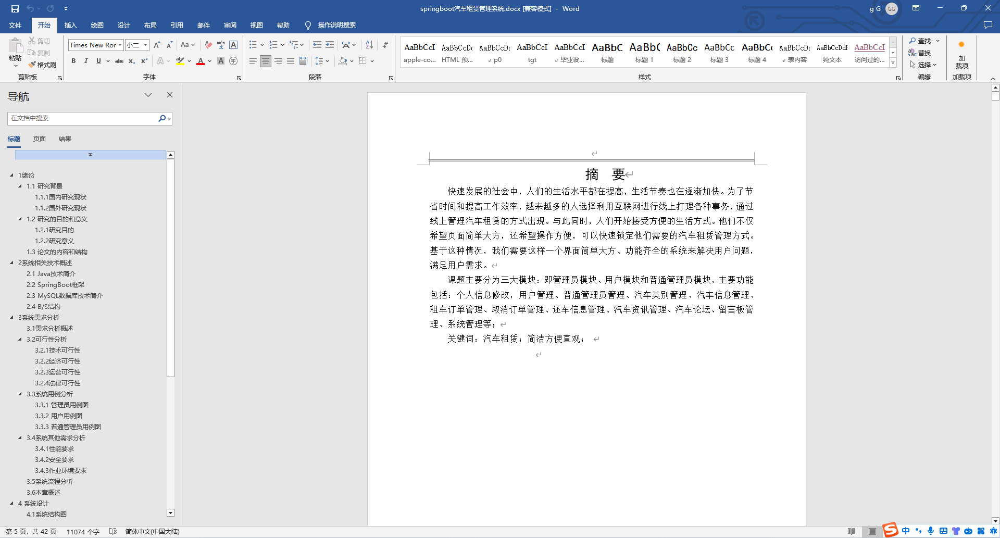
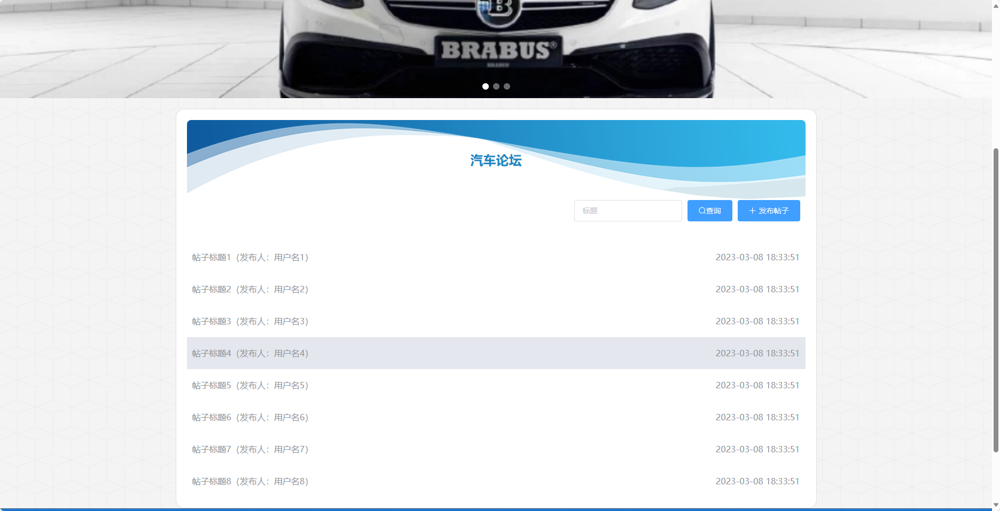
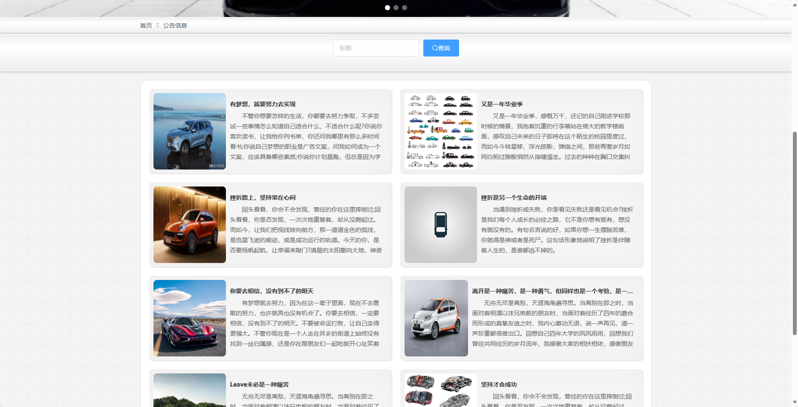
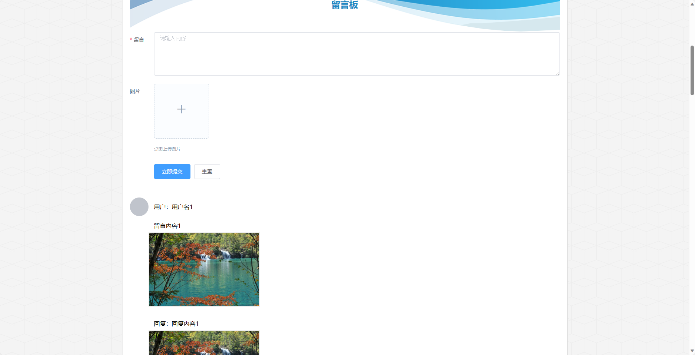
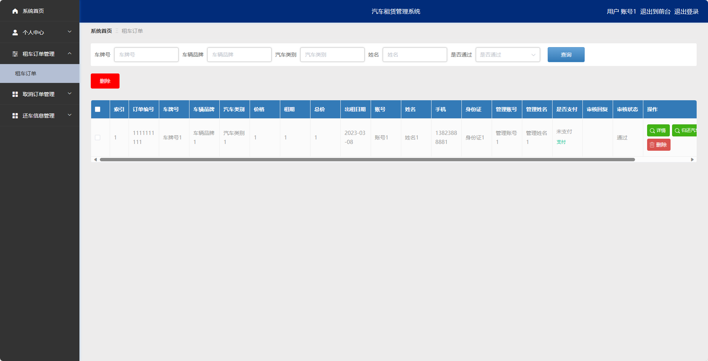
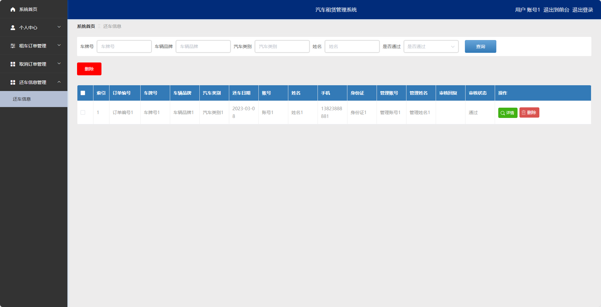
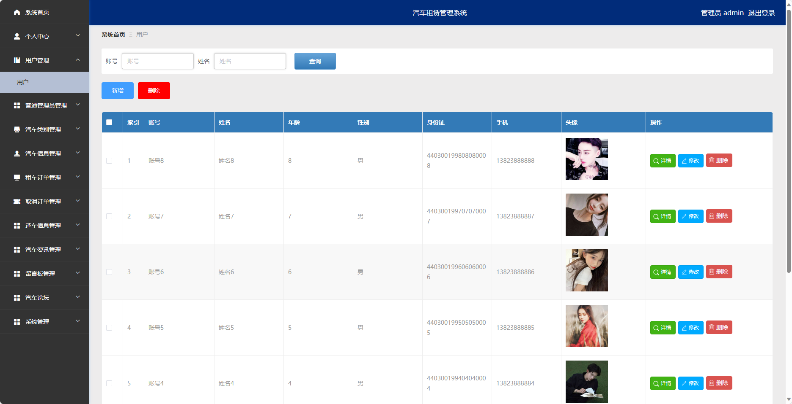

## 基于SpringBoot的汽车租赁管理系统(程序+报告)

###  获取sql数据库文件: 从戎源码网 (https://armycodes.com/) QQ: 386869957 QQ群: 377586148
###  所有系统地址: (https://github.com/YuLin-Coder/AllProjectCatalog) 
###  所有项目以及源代码本人均调试运行无问题 可支持远程安装部署调试、定制修改、代码讲解

## 项目介绍
基于SpringBoot的汽车租赁管理系统，系统包含两种角色：管理员、用户,系统分为前台和后台两大模块，主要功能如下。

前台:
- 首页：展示系统的概览信息。
- 汽车信息：展示可租赁的汽车的品牌、型号、价格等信息。
- 汽车资讯：提供最新的汽车行业资讯、车型评测、保养知识等。
- 汽车论坛：用户可以在这里发布自己的汽车使用心得、交流汽车相关的话题等。
- 公告信息：系统管理员可以发布一些重要的系统公告信息。
- 留言板：提供用户反馈系统问题、意见建议等。

后台：
管理员角色：
- 个人中心：管理员可以管理个人信息，修改密码等。
- 用户管理：管理员可以管理用户信息，包括查看用户列表、添加、编辑、删除等操作。
- 普通管理员管理：管理员可以管理普通管理员信息，包括查看管理员列表、添加、编辑、删除等操作。
- 汽车类别管理：管理员可以管理汽车的类别信息，包括查看分类列表、添加、编辑、删除等操作。
- 汽车信息管理：管理员可以管理可租赁的汽车信息，包括查看汽车列表、添加、编辑、删除等操作。
- 租车订单管理：管理员可以管理用户的租车订单信息，包括查看订单列表、处理订单状态等操作。
- 取消订单管理：管理员可以管理用户的取消订单信息，包括查看订单列表、处理订单状态等操作。
- 还车信息管理：管理员可以管理用户的还车信息，包括查看还车列表、处理还车状态等操作。
- 汽车资讯管理：管理员可以管理汽车行业资讯、车型评测、保养知识等，包括查看、添加、编辑、删除等操作。
- 留言板管理：管理员可以管理留言板信息，包括查看留言列表、删除留言等操作。
- 汽车论坛：管理员可以管理汽车论坛信息，包括查看帖子列表、删除帖子等操作。
- 系统管理：管理员可以管理系统的参数设置、日志查看等功能。

普通管理员角色：
- 个人中心：管理员可以管理个人信息，包括修改密码等。
- 汽车信息管理：管理员可以管理可租赁的汽车信息，包括查看汽车列表、添加、编辑、删除等操作。
- 租车订单管理：管理员可以管理用户的租车订单信息，包括查看订单列表、处理订单状态等操作。
- 取消订单管理：管理员可以管理用户的取消订单信息，包括查看订单列表、处理订单状态等操作。
- 还车信息管理：管理员可以管理用户的还车信息，包括查看还车列表、处理还车状态等操作。
- 汽车资讯管理：管理员可以管理汽车行业资讯、车型评测、保养知识等，包括查看、添加、编辑、删除等操作。

用户角色：
- 个人中心：用户可以管理个人信息，包括修改密码等。
- 租车订单管理：用户可以查看自己的租车订单信息，包括已租赁的汽车订单详情。
- 取消订单管理：用户可以查看自己的取消订单信息，包括已取消的汽车订单详情。
- 还车信息管理：用户可以提交还车信息，包括还车时间、还车地点等。

## 项目技术
- 编程语言：Java
- 数据库：MySQL
- 项目管理工具：Maven
- 前端技术：HTML、CSS、JavaScript、Jquery、Vue
- 后端技术：Spring、SpringMVC、MyBatis

## 运行环境
- JDK版本：JDK1.8及以上
- 开发工具：IDEA、Ecplise、Myecplise都可以
- 数据库: MySQL5.7及以上
- Maven：maven3.0及以上
- Node：14.14.0及以上

## 运行截图

